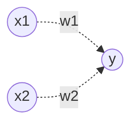
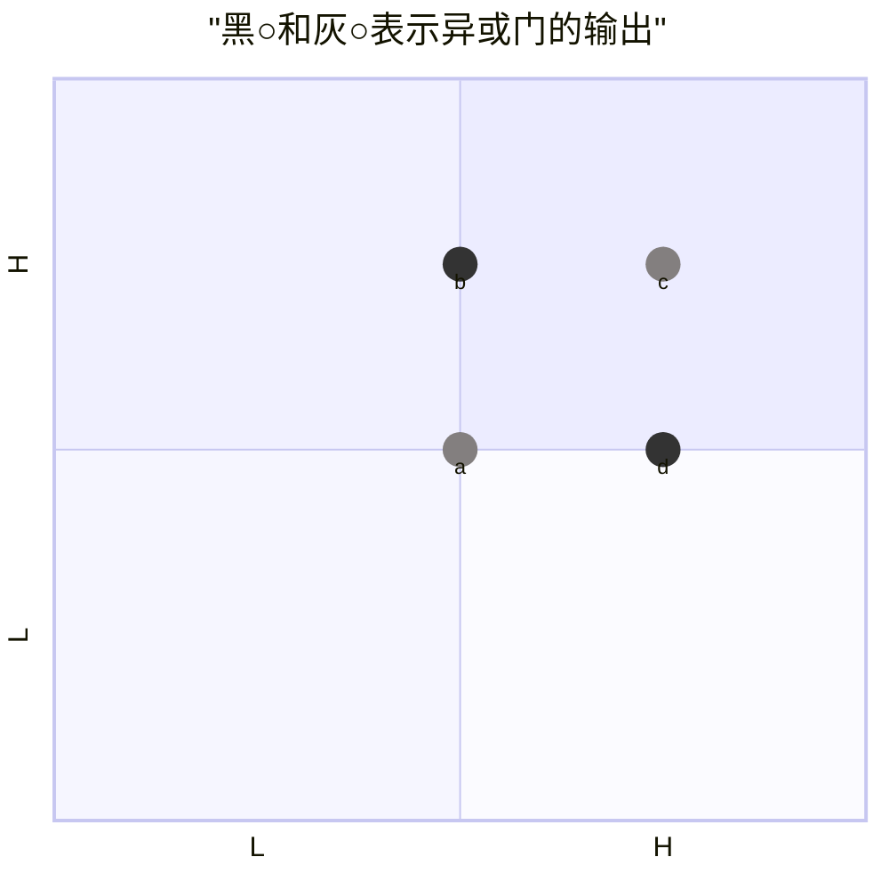
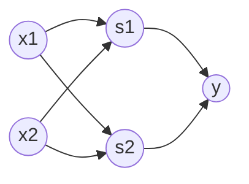

本章介绍感知机这一算法。为何我们现在还要学习这一很久以前就有的算法呢？因为感知机也是作为神经网络(深度学习)的起源的算法。因此，学习感知机的构造也就是学习通向神经网络和深度学习的一种重要思想。

## 感知机是什么

感知机接收多个输入信号，输出一个信号。这里所说的“信号”可以想象成电流或河流那样具备“流动性”的东西。感知机的信号只有“流/不流”（1/0）两种取值。


x1、x2是输入信号，y是输出信号，w1、w2是权重，图中的〇称为“神经元”或者“节点”
输入信号被送往神经元时，会被分别乘以固定的权重(w1x1、w2x2)。
神经元会计算传送过来的信号的总和，只有当这个总和超过了某个限定值时，才会输出1。这也称为“神经元被激活“。这里将这个界限值称为阈值，用符号$\theta$表示。

感知机的运行原理只有这些！把上述内容用数学式来表示，就是：
```math
y=
\begin{cases}
0(w1x1 + w2x2 <= \theta),\\
1(w1x1 + w2x2 > \theta)
\end{cases}
```

> :pushpin:
> 权重相当于电流里所说的电阻。电阻是决定电流流动难度的参数，电阻越低，通过的电流就越大
> 而感知机的权重则是值越大，通过的信号就越大

## 简单逻辑电路

与门、与非门、或门的感知机构造是一样的

> :pushpin:
> 这里决定感知机参数的并不是计算机，而是我们人。我们看着真值表这种”训练数据“，人工考虑（想到）了参数的值
> 而机器学习的课题就是将这个决定参数值的工作交由计算机自动进行的
> **学习**是确定合适的参数的过程，而人要做的是思考感知机的构造（模型），并把训练数据交给计算机

## 感知机的局限性

实际上，用前面介绍的感知机是无法实现异或门的

感知机可视化

黑○和灰○无法用一条直线分开，但是如果将”直线“这个限制条件去掉，就可以实现了

感知机的局限性就在于它只能表示由一条直线分割的空间，使用曲线可以分开黑○和灰○

曲线分割而成的空间称为非线性空间，由直线分割而成的空间称为线性空间

## 多层感知机

实际上，感知机的绝妙之处在于它可以”叠加层“（通过叠加层来表示异或门）

### 已有门电路的组合

异或门的制作方法有很多，其中之一就是组合与门、与非门、或门进行配置

> :pushpin:
> 感知机的局限性，严格地讲，应该是”单层感知机无法表示异或门“或者”单层感知机无法分离非线性空间“

### 异或门的实现

```python
def XOR(x1, x2)
    s1 = NAND(x1, x2)
    s2 = OR(x1, x2)
    y = AND(s1, s2)
    return y
```

异或门是一种多层结构的神经网络，这里将最左边的一列称为第0层，中间一列称为第1层，最右边的一列称为第2层
实际上，与门、或门是单层感知机，而异或门是第2层感知机，叠加了多层的感知机也称为**多层感知机**

**用感知机表示异或门**

1. 第0层的两个神经元接收输入信号，并将信号发送至第1层的神经元
2. 第1层的神经元将信号发送至第2层的神经元，第2层的神经元输出y

## 从与非门到计算机

计算机是处理信息的机器。向计算机中输入一些信息后，它会按照某种既定的方法进行处理，然后输出结果。所谓”按照某种既定的方法进行处理“是指，计算机和感知机一样，也有输入和输出，会按照某个既定的规则进行计算

人们一般会认为计算机内部进行的处理非常复杂，而令人惊讶的是，实际上只需要通过与非门的组合，就能再现计算机进行的处理。这一令人吃惊的事实说明了什么呢？说明使用感知机也可以表示计算机

-------

## 本章所学的内容

1. 感知机是具有输入和输出的算法。给定一个输入后，将输出一个既定的值
2. 感知机将权重和偏置设定为参数
3. 使用感知机可以表示与门和或门等逻辑电路
4. 异或门无法通过单层感知机来表示
5. 使用2层感知机可以表示异或门
6. 单层感知机只能表示线性空间，而多层感知机可以表示非线性空间
7. 多层感知机（在理论上）可以表示计算机
